## Task2
#### SQL指令
```sql
create database website;
use website;
create table member(
id bigint primary key AUTO_INCREMENT,
name varchar(255) NOT NULL,
username varchar(255) NOT NULL,
password varchar(255) NOT NULL,
follower_count int UNSIGNED NOT NULL DEFAULT 0,
time datetime NOT NULL DEFAULT CURRENT_TIMESTAMP());

```
#### 命令列截圖
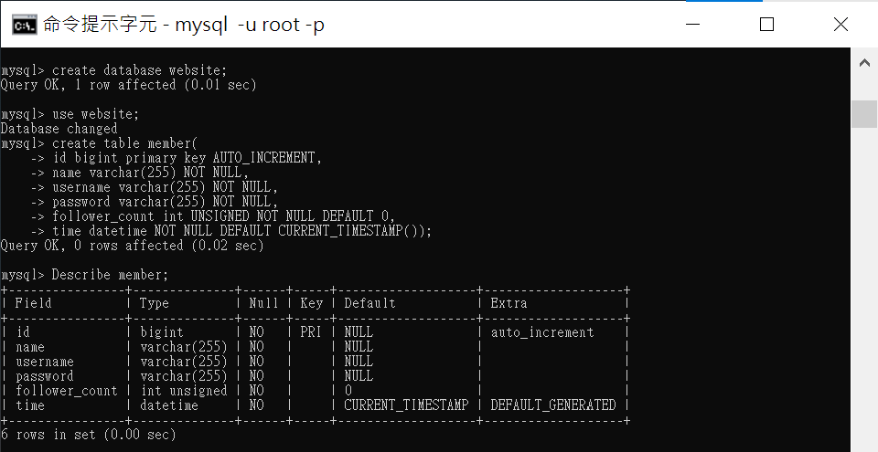
---
## Task3
### Task3-1
#### SQL指令
```sql
Insert into member (name,username,password) values ("test","test","test");
Insert into member (name,username,password) values ("member1","m1","m1pw");
Insert into member (name,username,password) values ("member2","m2","m2pw");
Insert into member (name,username,password) values ("member3","m3","m3pw");
Insert into member (name,username,password) values ("member4","m4","m4pw");
```
#### 命令列截圖
 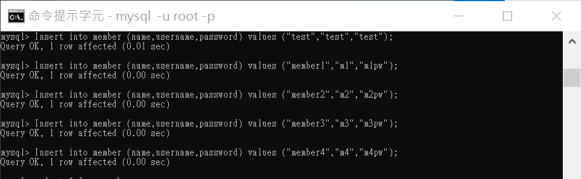

### Task3-2
#### SQL指令
```sql
select * from member;
```
#### 命令列截圖
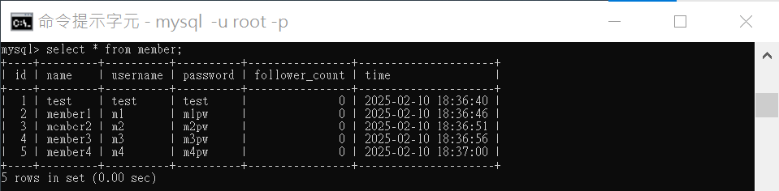
### Task3-3
#### SQL指令
```sql
select * from member
order by time desc;
```
#### 命令列截圖
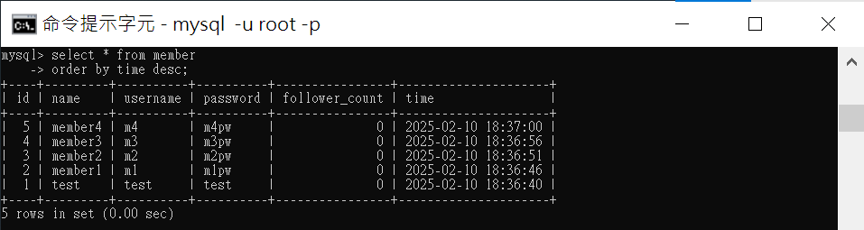
### Task3-4
#### SQL指令
```sql
select * from member
order by time desc
limit 3;
```
#### 命令列截圖
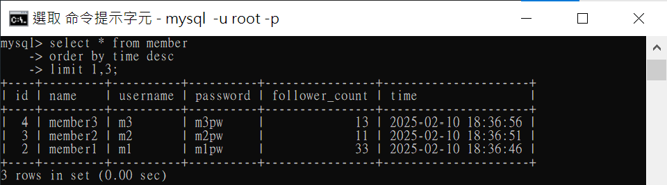
### Task3-5
#### SQL指令
```sql
select * from member
where username="test";
```
#### 命令列截圖
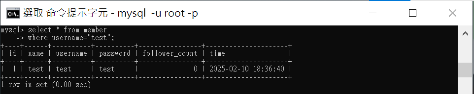
### Task3-6
#### SQL指令
```sql
select * from member
where name like "%es%";
```
#### 命令列截圖

### Task3-7
#### SQL指令
```sql
select * from member
where username="test" and password="test";
```
#### 命令列截圖
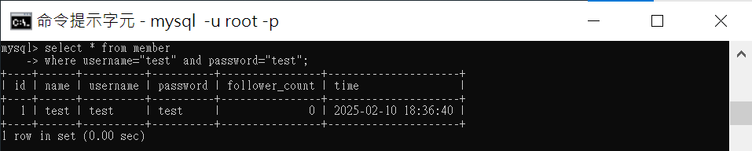
### Task3-8
#### SQL指令
```sql
UPDATE member
SET name = "test2"
WHERE username="test";
```
#### 命令列截圖
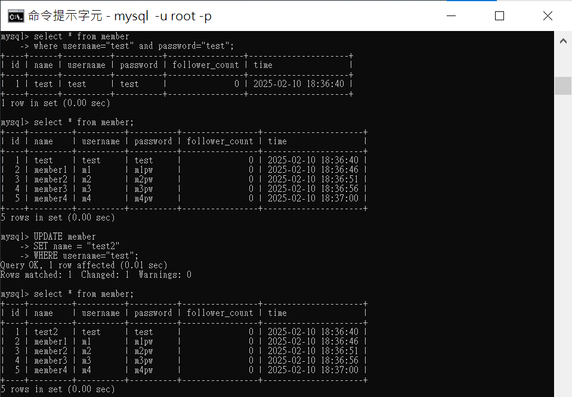
---
## Task4
### Task4-1
#### SQL指令
```sql
select count(*) as count_of_records
from member; 
```
#### 命令列截圖
 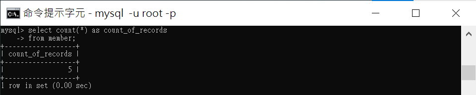

### Task4-2
#### SQL指令
```sql
select SUM(follower_count) as total_follower_count
from member; 
```
#### 命令列截圖
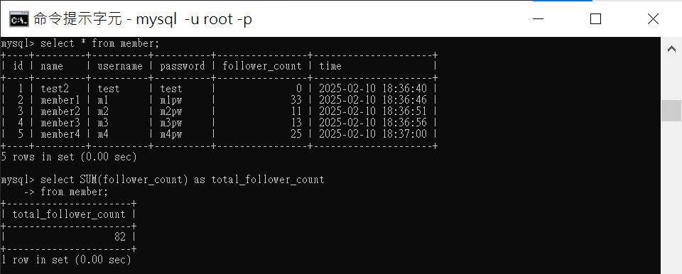
### Task4-3
#### SQL指令
```sql
select AVG(follower_count) as total_follower_count
from member; 
```
#### 命令列截圖
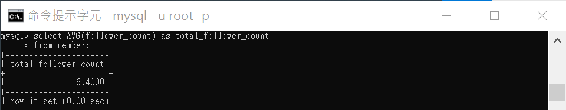
### Task4-4
#### SQL指令
```sql
select AVG(filter.follower_count) as first_2_follower_count
from (select * from member
order by follower_count desc
limit 2
) AS filter;
```
#### 命令列截圖
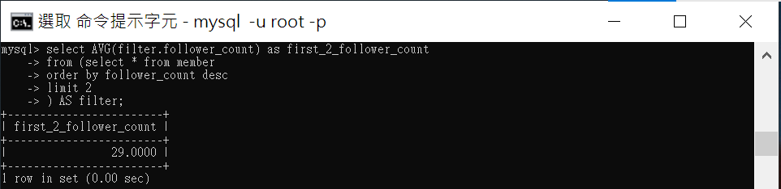
---
## Task5
### Task5-1
#### SQL指令
```sql
create table message(
id bigint primary key AUTO_INCREMENT,
member_id bigint NOT NULL,
CONSTRAINT ID_CONSTRAINT FOREIGN KEY (member_id) REFERENCES member(id),
content varchar(255) NOT NULL,
like_count int UNSIGNED NOT NULL DEFAULT 0,
time datetime NOT NULL DEFAULT CURRENT_TIMESTAMP()
);
```
#### 命令列截圖
 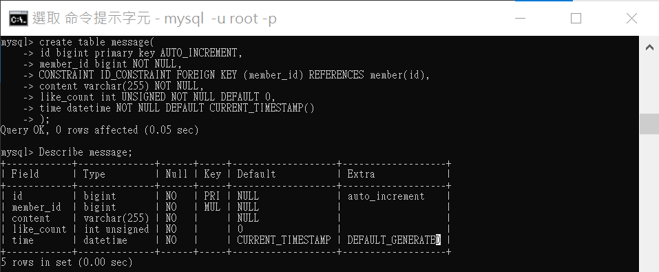

### Task5-2
#### SQL指令
```sql
select mes.*,mem.name as member_name
from message mes
join member mem on mes.member_id=mem.id;
```
#### 命令列截圖
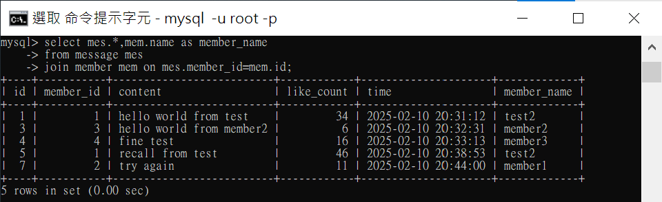
### Task5-3
#### SQL指令
```sql
select mes.*,mem.name as member_name
from message mes
join member mem on mes.member_id=mem.id
where mem.username="test";
```
#### 命令列截圖
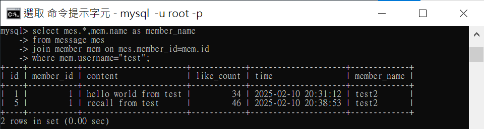
### Task5-4
#### SQL指令
```sql
select filter.username as member_username,avg(filter.like_count) as test_avg_like
from (select mes.*,mem.username
from message mes
join member mem on mes.member_id=mem.id
where mem.username="test") AS filter;
```
#### 命令列截圖
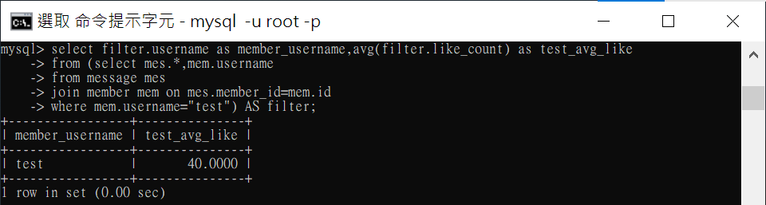
### Task5-5
#### SQL指令
```sql
select filter.username as member_username,avg(filter.like_count) as test_avg_like
from (select mes.*,mem.username
from message mes
join member mem on mes.member_id=mem.id) AS filter
group by filter.username;
```
#### 命令列截圖
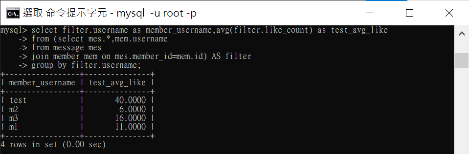
---